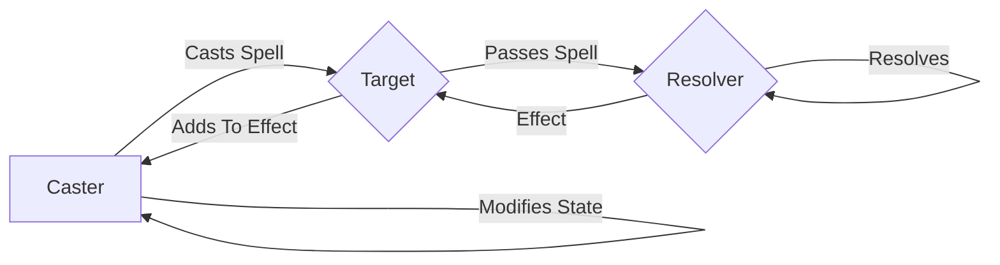
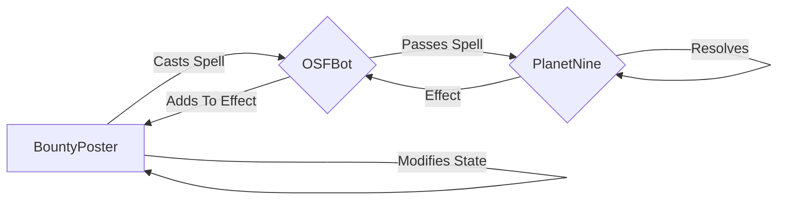

# Planet Nine

*Planet Nine* (named for a [hypothetical planet] that may exist out past Neptune) is the top layer of The Stack that starts with [Sessionless][sessionless].
It handles the resolution of MAGIC spells, and disburses digital items amongst participants.
It's probably closest in spirit to a cooperative bank (in the US these are called credit unions) where the owners are any and all participants of anything that uses Planet Nine.

## Overview

The Planet Nine server is essentially a publically available payment processor with two additional features.
First it can handle "payments" of things that aren't money.
Seccond it can attach meaningful things to the transactions--think of a receipt that is useful or collectible in some way.

In The Stack ecosystem, Planet Nine is a [Resolver][resolver].
It can be used for monied transactions[^1], but for right now I'll focus on non-monied transactions here.

Because Planet Nine generates useful things when spells resolve, some gating mechanism is necessary to prevent people from just spamming requests.
This gate is a stored value system called mp.
MP is granted to each user, and is expended with non-monied spells, and then recharges over time.
If you've played Skyrim, it works just like the Magika bar.

So what are those useful things? 
With every spell, Planet Nine is able to disburse money, (experience) points, or tokens[^2] called [Nineum][nineum].
Again I'll leave money for now.

The points are attached to the uuid being used in the spell, and persist throughout any digital context where that uuid is used.
They can be used to create a level system in one context or another, or just as some overall store of points.

Nineum is a 128-bit interger, which encodes a set of properties that can be used to map to digital things like armor in a game like Skyrim, or cards in a game like Hearthstone, or collectible monsters in a game like Pokemon.
It can also map to things like rewards, and badges, and achievements.
And yes it can map to bad digital artwork if you really want.

Ok, so how does this work?
Here's the flowchart of a spell from MAGIC:



In the case of [Open Source Force][osf]'s bounty bot, the caster would be the person posting the bounty, the target would be the bot, and the resolver is Planet Nine.
So:



When the spell resolves, the bot will be assigned Nineum by Planet Nine, which it can then transfer to whomever it is that completes the bounty.
It can also grant points at that time, and eventually, should someone supply it, money.

## API

So there're some basic CRUD operations for user management. 
The cool APIs are `resolve`, `transfer`, and `grant` at the bottom.

<details>
 <summary><code>PUT</code> <code><b>/user/create</b></code> <code>Creates a new user if pubKey does not exist, and returns existing uuid if it does.</code></summary>

##### Parameters

> | name         |  required     | data type               | description                                                           |
> |--------------|-----------|-------------------------|-----------------------------------------------------------------------|
> | pubKey       |  true     | string (hex)            | the publicKey of the user's keypair  |
> | timestamp    |  true     | string                  | in a production system timestamps narrow window for replay attacks  |
> | signature    |  true     | string (signature)      | the signature from sessionless for the message  |


##### Responses

> | http code     | content-type                      | response                                                            |
> |---------------|-----------------------------------|---------------------------------------------------------------------|
> | `200`         | `application/json`                | `USER`   |
> | `400`         | `application/json`                | `{"code":"400","message":"Bad Request"}`                            |

##### Example cURL

> ```javascript
>  curl -X PUT -H "Content-Type: application/json" -d '{"pubKey": "key", "timestamp": "now", "signature": "sig"}' https://<placeholderURL>/user/create
> ```

</details>

<details>
 <summary><code>GET</code> <code><b>/user/:uuid?timestamp=<timestamp>&signature=<signature></b></code> <code>Returns a user by their uuid</code></summary>

##### Parameters

> | name         |  required     | data type               | description                                                           |
> |--------------|-----------|-------------------------|-----------------------------------------------------------------------|
> | timestamp    |  true     | string                  | in a production system timestamps prevent replay attacks  |
> | signature    |  true     | string (signature)      | the signature from sessionless for the message  |


##### Responses

> | http code     | content-type                      | response                                                            |
> |---------------|-----------------------------------|---------------------------------------------------------------------|
> | `200`         | `application/json`                | `USER`   |
> | `406`         | `application/json`                | `{"code":"406","message":"Not acceptable"}`                            |

##### Example cURL

> ```javascript
>  curl -X GET -H "Content-Type: application/json" https://<placeholderURL>/<uuid>?timestamp=123&signature=signature 
> ```

</details>

<details>
 <summary><code>GET</code> <code><b>/user/pubKey/:pubKey?timestamp=<timestamp>&signature=<signature></b></code> <code>Returns a user by pubKey</code></summary>

##### Parameters

> | name         |  required     | data type               | description                                                           |
> |--------------|-----------|-------------------------|-----------------------------------------------------------------------|
> | timestamp    |  true     | string                  | in a production system timestamps prevent replay attacks  |
> | signature    |  true     | string (signature)      | the signature from sessionless for the message  |


##### Responses

> | http code     | content-type                      | response                                                            |
> |---------------|-----------------------------------|---------------------------------------------------------------------|
> | `200`         | `application/json`                | `USER`   |
> | `406`         | `application/json`                | `{"code":"406","message":"Not acceptable"}`                            |

##### Example cURL

> ```javascript
>  curl -X GET -H "Content-Type: application/json" https://<placeholderURL>/<uuid>?timestamp=123&signature=signature 
> ```

</details>

<details>
  <summary><code>POST</code> <code><b>/resolve</b></code> <code>Resolves a spell</code></summary>

##### Parameters

> | name         |  required     | data type               | description                                                           |
> |--------------|-----------|-------------------------|-----------------------------------------------------------------------|
> | spell        |  true     | object                  | [SPELL]  |


##### Responses

> | http code     | content-type                      | response                                                            |
> |---------------|-----------------------------------|---------------------------------------------------------------------|
> | `200`         | `application/json`                | `{success: <bool>, signatureMap: TBD}`   |
> | `400`         | `application/json`                | `{"code":"400","message":"Bad Request"}`                            |

##### Example cURL

> ```javascript
>  curl -X POST -H "Content-Type: application/json" -d '[SPELL]' https://<placeholderURL>/user/<uuid>/associate
> ```

</details>

<details>
  <summary><code>POST</code> <code><b>/user/:uuid/transfer</b></code> <code>Transfers Nineum to another Planet Nine uuid</code></summary>

##### Parameters

> | name         |  required     | data type               | description                                                           |
> |--------------|-----------|-------------------------|-----------------------------------------------------------------------|
> | timestamp    |  true     | string                  | in a production system timestamps prevent replay attacks  |
> | uuid         |  true     | string                  | the transferer's uuid
> | destinationUUID | true   | string                  | the transferee's uuid
> | nineumUniqueIds | true   | string[]                | the nineum to transfer as hex coded Int128s
> | price        |  false    | Int                     | price of the transfer (can be null or 0 for free transfers)
> | currency     |  false    | string                  | the currency for the transaction
> | signature    |  true     | string (signature)      | the signature from sessionless for the message  |


##### Responses

> | http code     | content-type                      | response                                                            |
> |---------------|-----------------------------------|---------------------------------------------------------------------|
> | `200`         | `application/json`                | `USER`   |
> | `400`         | `application/json`                | `{"code":"400","message":"Bad Request"}`                            |

##### Example cURL

> ```javascript
>  curl -X POST -H "Content-Type: application/json" -d '<will fill this in later>' https://<placeholderURL>/user/<uuid>/associate
> ```

</details>

<details>
  <summary><code>POST</code> <code><b>/user/:uuid/grant</b></code> <code>Grants point to a Planet Nine user</code></summary>

##### Parameters

> | name         |  required     | data type               | description                                                           |
> |--------------|-----------|-------------------------|-----------------------------------------------------------------------|
> | timestamp    |  true     | string                  | in a production system timestamps prevent replay attacks  |
> | uuid         |  true     | string                  | the granter's uuid
> | receiverUUID |  true     | string                  | receiver's uuid
> | amount       |  true     | Int                     | the amount of points to grant
> | description  |  false    | string                  | An optional description of the grant
> | signature    |  true     | string (signature)      | the signature from sessionless for the message  |


##### Responses

> | http code     | content-type                      | response                                                            |
> |---------------|-----------------------------------|---------------------------------------------------------------------|
> | `200`         | `application/json`                | `USER`   |
> | `400`         | `application/json`                | `{"code":"400","message":"Bad Request"}`                            |

##### Example cURL

> ```javascript
>  curl -X POST -H "Content-Type: application/json" -d '<will fill this in later>' https://<placeholderURL>/user/<uuid>/grant
> ```

</details>

[hypothetical planet]: https://en.wikipedia.org/wiki/Planet_Nine
[sessionless]: https://www.github.com/planet-nine-app/sessionless
[resolver]: https://github.com/planet-nine-app/MAGIC/blob/main/README-DEV.md#resolvers
[nineum]: https://github.com/planet-nine-app/planet-nine/blob/main/Nineum.md
[osf]: https://opensourceforce.net

[^1]: "I am actively working on this for Julia, and the MAGIC demo."
[^2]: "Technically Nineum is a non-fungible token (well more accurately a half-fungible token[^3]), but the crypto bros ruined that concept so thoroughly that I've had to scrub all reference to the idea from everything I write.
But I'd like to remind the readers of this that mapping digital things to strings and numbers has had usefulness long before Ethereum ruined the concept.
[^3]: "When you read about fungibility, it’s usually presented as a binary--either something is fungible or it isn’t. 
But the real world is of course never so simple. 
There are a whole range of goods that are fungible in one respect and non-fungible in another. 
Take beer as an example. 
Beer manufacturers go to great lengths to ensure that each of their beers taste the same, that they would be fungible with each other. 
At the same time Beer manufacturers go to great lengths to ensure that their beer does not taste like any competitors’ making their beer non-fungible with other brands. 
Virtually everything we consume that’s branded falls into this category of fungible within/non-fungible without. 
For lack of a better term, let’s call these types of goods half-fungible."
